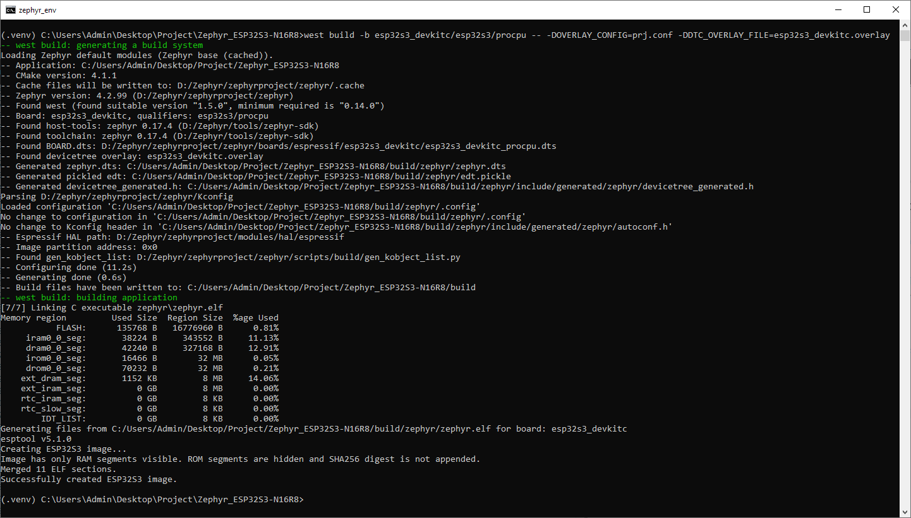
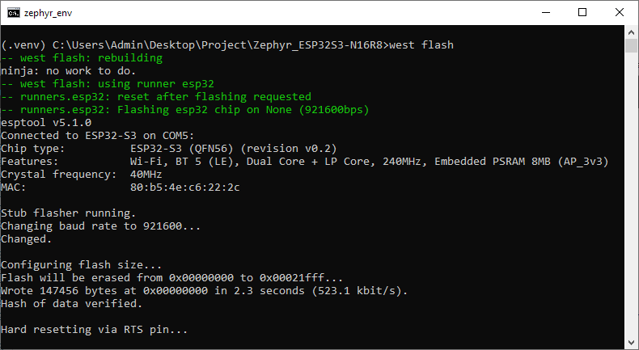
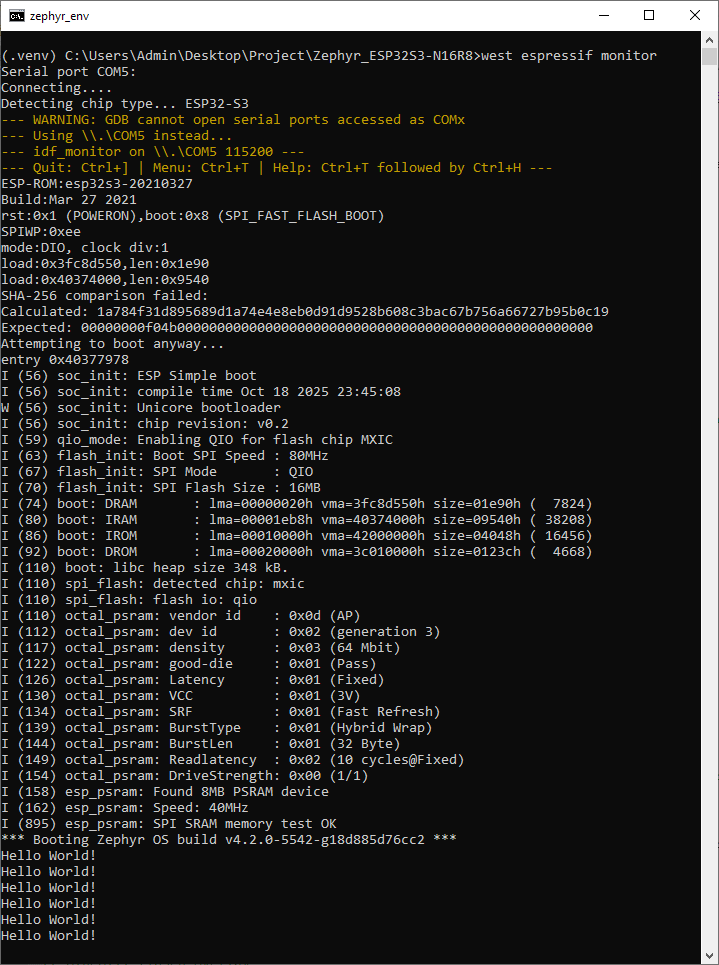

# Hello World Template for ESP32-S3-N16R8 (Zephyr RTOS)

[](https://opensource.org/licenses/MIT)
[](https://www.zephyrproject.org/)
[](https://docs.zephyrproject.org/latest/boards/espressif/esp32s3_devkitc/doc/index.html)

A minimal, production-ready template for Zephyr RTOS on the ESP32-S3 N16R8 board. Features one-click building, flashing, and monitoring from VS Code, with a pre-configured setup for 16MB Flash and 8MB PSRAM.

✨ **Perfect for beginners** | 🚀 **Ready for production** | 🛠️ **VS Code integrated**

## Prerequisites

Before using this template, make sure you have:

- ✅ Zephyr RTOS installed and configured
- ✅ West build system
- ✅ ESP32 toolchain (`xtensa-espressif_esp32s3`)
- ✅ USB Type-C cable
- ✅ Visual Studio Code (optional, but recommended)

💡 **New to Zephyr?** Check out our installation guide: [Manual Zephyr RTOS Installation on Windows](https://www.hackster.io/gkiryaziev/manual-zephyr-rtos-installation-on-windows-0cc2a5)

## Quick Start

**Activate the virtual environment for `west`**. Instructions on how to create it are described in the Manual Zephyr RTOS Installation on Windows guide.

1.  **Clone or download this template**
    ```bash
    git clone https://github.com/gkiryaziev/Zephyr_ESP32S3-N16R8.git
    cd Zephyr_ESP32S3-N16R8
    ```

2.  **Connect your ESP32-S3 board**
    - Connect a USB cable to the board's USB-to-UART port.
    - Plug the other end into your computer.

3.  **Build the project**
    - In VS Code: `Terminal → Run Task → Build`
    - Or from command line: `west build -b esp32s3_devkitc/esp32s3/procpu -- -DOVERLAY_CONFIG=prj.conf -DDTC_OVERLAY_FILE=esp32s3_devkitc.overlay`

4.  **Flash the board**
    - In VS Code: `Terminal → Run Task → Flash`
    - Or from command line: `west flash`

5.  **Monitor the output**
    - In VS Code: `Terminal → Run Task → Monitor`
    - Or from command line: `west espressif monitor`

6.  **Success!** You should see "Hello World!" printed in the terminal every second.

If trouble occurs, see the **[Troubleshooting](#troubleshooting)** section.

As a result, you should get something like this.





---

## 1. Hardware Configuration: Memory (Flash & PSRAM)

This project is specifically configured for a board with **16MB of Flash** and **8MB of PSRAM** via the `esp32s3_devkitc.overlay` file.

The template achieves this by defining the memory sizes and including a standard 16MB partition table (`partitions_0x0_amp_16M.dtsi`) directly in the overlay. This approach avoids the need for command-line snippets.

### For Boards with Different Memory Sizes

If your board has a different Flash/PSRAM configuration (e.g., 8MB Flash, 2MB PSRAM), follow these steps:

1.  **Clear or delete** the contents of the `esp32s3_devkitc.overlay` file.
2.  In `.vscode/tasks.json`, find the `Build` task and **uncomment** the `-S` arguments.
3.  **Modify the arguments** to match your board's specifications (e.g., `"flash-8M"`, `"psram-2M"`). A list of available snippets can be found in the Zephyr [documentation](https://docs.zephyrproject.org/latest/boards/espressif/esp32s3_devkitc/doc/index.html#board-variants-using-snippets).

The relevant (commented-out) lines in `.vscode/tasks.json` are:
```json
// "-S", "flash-16M",
// "-S", "psram-8M",
```

## 2. Project Configuration

The main project settings are located in the `prj.conf` file.

### Memory Modes

-   `CONFIG_ESP_SPIRAM=y`: Enables support for external SPI RAM (PSRAM). This was taken from the standard Zephyr `psram` snippet.
-   `CONFIG_SPIRAM_MODE_OCT=y`: Enables **Octal SPI** mode for PSRAM, which uses 8 data lines for communication, providing very high-speed access to external memory.
-   `CONFIG_ESPTOOLPY_FLASHMODE_QIO=y`: Enables **Quad I/O** mode for the main Flash memory. It uses 4 data lines to accelerate code and data fetching from Flash.

### Memory Speed

By default, both Flash and PSRAM operate at 40MHz. To boost performance, you can switch to **80MHz** by uncommenting the following lines in `prj.conf`:

```ini
# Uncomment for higher performance
# CONFIG_SPIRAM_SPEED_80M=y
# CONFIG_ESPTOOLPY_FLASHFREQ_80M=y
```

## 3. VS Code Tasks

The `.vscode/tasks.json` file contains pre-configured tasks for building, flashing, and cleaning the project. You can run them via the `Terminal -> Run Task...` menu.

-   **`Build`**: Compiles the project. The `west build` command uses the `prj.conf` and `esp32s3_devkitc.overlay` files for the correct build configuration.

-   **`Flash`**: Flashes the compiled firmware to the board using `west flash`.

-   **`Monitor`**: Starts the `west espressif monitor` tool to view `printk` output from the device.

-   **`Clean`**: Deletes the `build` directory, clearing out the results of previous builds.

```json
// .vscode/tasks.json
{
    "version": "2.0.0",
    "tasks": [
        {
            "label": "Build",
            "type": "shell",
            "command": "west",
            "args": [
                "build",
                // "-p","always",
                "-b", "esp32s3_devkitc/esp32s3/procpu",
                // "-S", "flash-16M",
                // "-S", "psram-8M",
                "--",
                "-DOVERLAY_CONFIG=prj.conf",
                "-DDTC_OVERLAY_FILE=esp32s3_devkitc.overlay"
            ],
            "group": "build",
            "problemMatcher": []
        },
        {
            "label": "Flash",
            "type": "shell",
            "command": "west flash",
            "group": "build",
            "problemMatcher": []
        },
        {
            "label": "Clean",
            "type": "shell",
            "command": "rm -rf build",
            "group": "build",
            "problemMatcher": []
        },
        {
            "label": "Monitor",
            "type": "shell",
            "command": "west espressif monitor",
            "group": "build",
            "problemMatcher": []
        }
    ]
}
```

## 4. C/C++ IntelliSense Configuration

The `.vscode/c_cpp_properties.json` file is configured to provide the best possible IntelliSense (code completion, navigation) for the project via the VS Code C/C++ extension.

```json
// .vscode/c_cpp_properties.json
{
    "configurations": [
        {
            "name": "Zephyr",
            "compileCommands": "${workspaceFolder}/build/compile_commands.json"
        }
    ],
    "version": 4
}
```

It works by pointing the C/C++ extension to the `compile_commands.json` file. This file is **generated automatically by Zephyr's build system** when you run the `Build` task.

**Important:** For the code autocompletion to work correctly, you must run the **`Build`** task at least once after cloning the project or after a `Clean` task.

## Troubleshooting<a id='troubleshooting'></a>

### Problem: "west: command not found"

**Cause:** Zephyr environment not activated.

**Solution:** Run your `zephyr-env.cmd` script first (Windows) or source the Zephyr environment file (Linux/Mac). Your terminal prompt should show `(.venv)`.

---

### Problem: Flashing fails with "a serial exception occurred" or "Failed to connect"

**Cause:** The board is not in bootloader mode, or there is a connection issue.

**Solution:**
1.  Verify that you are using a **data-capable USB cable** (not a power-only one).
2.  Check that the correct COM port is selected. `west flash` usually finds it automatically, but conflicts can occur.
3.  Some ESP32-S3 boards require you to manually enter bootloader mode: **press and hold the `BOOT` button**, press and release the `RESET` button, then release the `BOOT` button. Try flashing again.

---

### Problem: Gibberish or no output in the serial monitor

**Cause:** Mismatched baud rate or a faulty connection.

**Solution:**
1.  The `west espressif monitor` task automatically sets the correct baud rate (115200). If you are using another serial monitor tool (e.g., PuTTY, Termite), make sure you configure it to **115200 baud, 8 data bits, no parity, 1 stop bit (8N1)**.
2.  Ensure the board is powered on and the USB cable is securely connected. Try pressing the `RESET` button on the board.